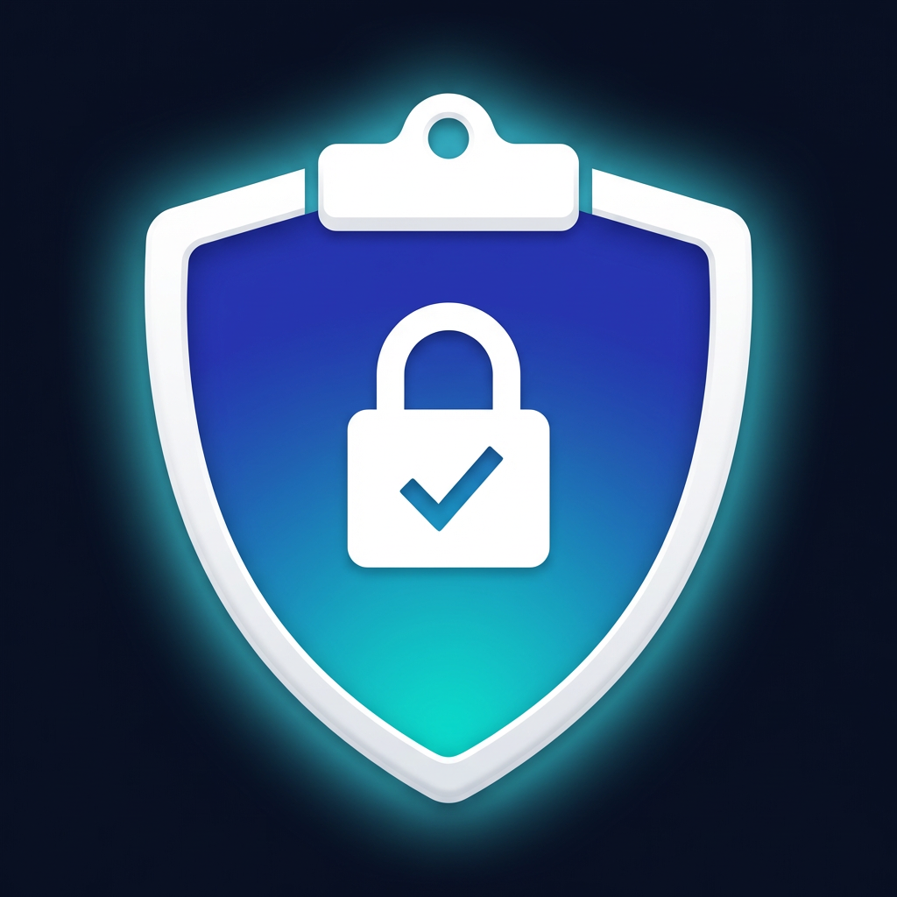

<div align="center">

<h1>ClipShield</h1>



<p>Auto-clear sensitive data from your macOS clipboard</p>
</div>

---

Silently detects credit card numbers, SSNs, and SINs in your clipboard and auto-clears them. Polls every 0.5s — detection is near-instant. Detects Cmd+V paste events and shortens the countdown so your clipboard is cleared seconds after you paste.

## Install

**Homebrew** (recommended):
```bash
brew install --cask maferland/tap/clipshield
```

**Manual**: Download DMG from [Releases](https://github.com/maferland/clipshield/releases), open it, drag `ClipShield.app` to Applications.

**Build from source**:
```bash
git clone https://github.com/maferland/clipshield.git
cd clipshield
make install
```

## Usage

Run `ClipShield`. A shield icon appears in your menu bar. That's it.

1. Copy sensitive data — countdown starts (default 30s)
2. Cmd+V to paste — countdown shortens to post-paste delay (default 2s)
3. Copy something else — countdown cancels
4. Countdown expires — clipboard cleared, notification shown

### Settings

| Setting | Default | Description |
|---------|---------|-------------|
| Enabled | On | Master toggle |
| Start at Login | Off | Launch automatically at login |
| Credit Cards | On | Visa, Mastercard, Amex (Luhn-validated) |
| SSN / SIN | On | US Social Security and Canadian Social Insurance numbers |
| Clear delay | 30s | Seconds before auto-clearing (5–120) |
| Post-paste delay | 2s | Seconds after Cmd+V before clearing (1–10) |

## Privacy

ClipShield runs entirely on your Mac. No network requests. No data collection. No analytics.

Sensitive data detected on the clipboard is immediately re-written with `org.nspasteboard.ConcealedType` so clipboard managers that support the convention auto-expire the entry.

## Requirements

- macOS 14 (Sonoma) or later
- Accessibility permission (optional — enables paste detection via Cmd+V)

## Support

If ClipShield helps you stay safe, consider buying me a coffee:

[](https://buymeacoffee.com/maferland)

## License

MIT — see [LICENSE](LICENSE)
